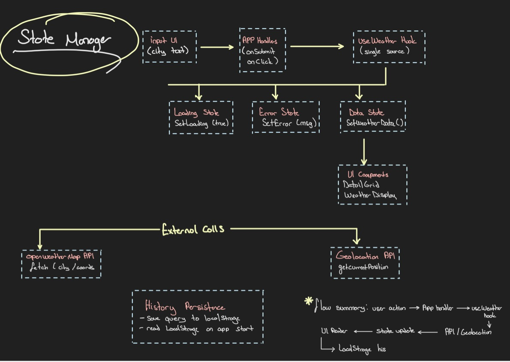
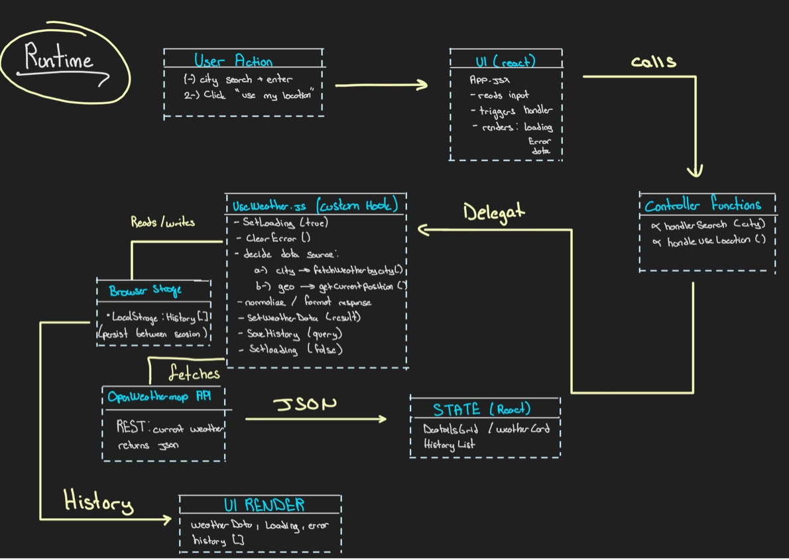

#  Weather App

A responsive and modern weather application built with **React**, designed to display real-time weather information through a clean and intuitive interface.  
Users can search for cities worldwide, check detailed weather data, and access a local history of their previous searches.

This project demonstrates core front-end skills such as **API integration**, **custom hooks**, **state management**, and **component architecture**—ideal for showcasing front-end capabilities.

---

##  Features

- Search weather by city name  
-  Fetch weather using device **Geolocation API**  
- View detailed weather metrics:  
  - Temperature  
  - Humidity  
  - Wind speed  
  - Pressure  
  - Feels like  
- Auto-saved search history via **LocalStorage**  
- Fast and dynamic UI using React Hooks  
- Fully responsive design  

---

##  Technologies Used

- **React**
- **JavaScript (ES6+)**
- **Custom Hooks**
- **OpenWeatherMap API**
- **CSS / TailwindCSS (depending on your version)**
- **LocalStorage**
- **Geolocation API**

---

##  Project Structure
src/
├── components/
│ ├── CountrySelect.jsx
│ ├── DetailsGrid.jsx
│ ├── HistoryList.jsx
│ └── ...
├── hooks/
│ └── useWeather.js
├── App.jsx
├── index.js
├── App.css
└── assets/

---

##  API Setup (IMPORTANT)

This project uses **OpenWeatherMap API**.  
Create an account and get your API key from:

https://openweathermap.org/api

Then create a `.env-example` file in the project root:

Restart the dev server after adding the key.

---

##  How It Works

### ✔ `useWeather.js` — Custom Hook  
Handles:
- Fetching weather by city  
- Fetching weather by geolocation  
- Loading & error states  
- Saving history to LocalStorage  

### ✔ Components  
- **CountrySelect** → Select country code  
- **DetailsGrid** → Show detailed weather metrics  
- **HistoryList** → Display recent searches  
- **App.jsx** → Main logic & layout  

---

## What I Learned

- How to consume REST APIs  
- Custom React hooks for logic separation  
- State management with `useState` & `useEffect`  
- Handling loading and error states  
- Using **LocalStorage** for persistent history  
- Implementing browser **Geolocation API**  
- Clean component architecture  

---

##  Roadmap

- Add hourly forecast  
- Add weekly forecast  
- Add animated weather icons  
- Add dark/light theme  
- Enhance mobile view  
- Deploy to Vercel / Netlify  
- Integrate backend proxy  
- Add charts for weather trends  

---

## Diagrams

### StateManager

### runtime

🌤️ **Clean UI. Accurate Data. Real-Time Weather.**  
Built with ❤️ using React.
